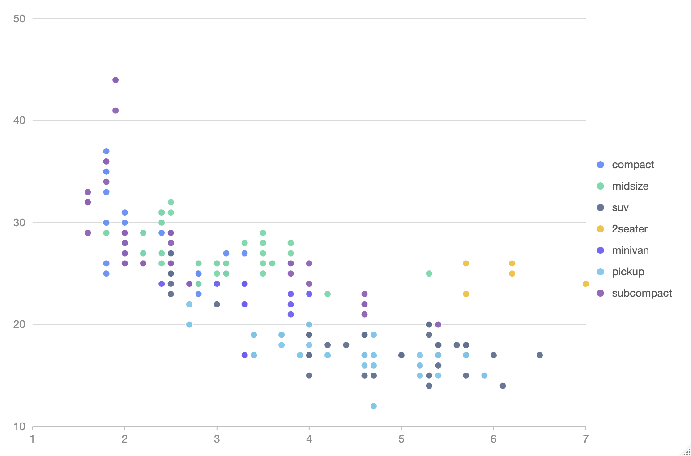

# rg2

<!-- badges: start -->

[](https://CRAN.R-project.org/package=rg2)
[](https://lifecycle.r-lib.org/articles/stages.html#stable)
<!-- badges: end -->

rg2 is a wrapper of [G2Plot](https://g2plot.antv.antgroup.com/) for R.

## Installation

You can install the development version of rg2 like so:

```r
pak::pkg_install("glfeng318/rg2")
```

## Example

This is a basic example which shows you how to render a plot:

``` r
library(rg2)

g2_scatter(iris,'Sepal.Length','Sepal.Width',colorField='Species') |> 
  g2_opt(
    legend=list(position='right'),
    shape='circle'
  ) |> 
  g2()
```


