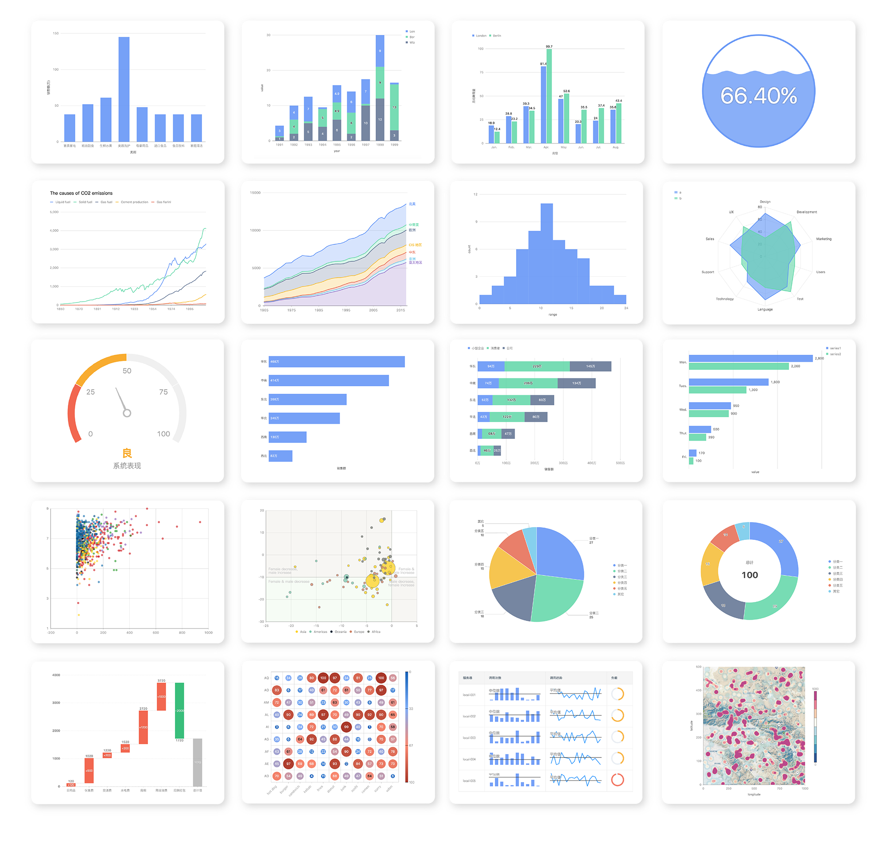
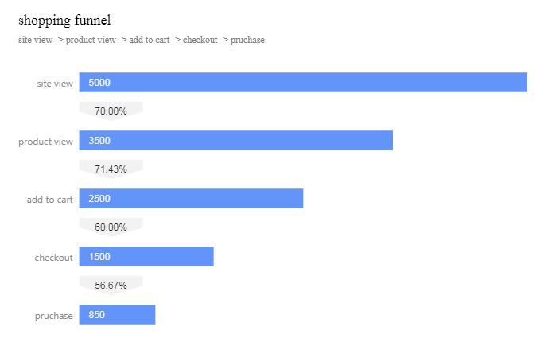

# rg2 


[](https://cran.r-project.org/package=rg2)

## Overview

rg2 is a wrapper of [G2Plot](https://g2plot.antv.vision/) for R.



## Installation

```
# install the development version from GitHub:
devtools::install_github("13kay/rg2")
```

## quickstart

```r
library(rg2)

df = jsonlite::fromJSON('[
{ "action": "site view", "pv": 5000 },
{ "action": "product view", "pv": 3500 },
{ "action": "add to cart", "pv": 2500 },
{ "action": "checkout", "pv": 1500 },
{ "action": "pruchase", "pv": 850 }]')

cfg = list(
  title = list(
    visible=TRUE, text='shopping funnel'
  ),
  description = list(
    visible=TRUE, text='site view -> product view -> add to cart -> checkout -> pruchase'
  ),
  conversionTag = list(visible=TRUE)
)

g2Bar(df, pv, action, cfg = cfg)
```


