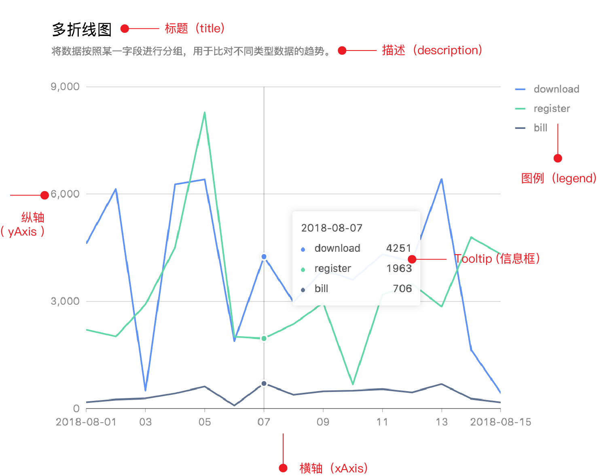

```{r, include = FALSE}
library(rg2)
knitr::opts_chunk$set(fig.dpi = 96, collapse = TRUE, comment = "#>")
```

As you can see that all rg2 functions get a `cfg` parameter, it's used for chart configuration. Almost all of the configurations can be set through `cfg`.

{width=95%}

## title and description

The title and description are invisible by default.

a example to configure title and description:
```{r fig.height=3, fig.width=3}
cfg = list(
  title = list(
    visible=TRUE, 
    text='title goes here'
  ),
  description = list(
    visible=TRUE, 
    text='this is the description text'
  )
)
g2Gauge(0.8, range=c(0,0.8,1), cfg = cfg)
```

There are four configuration items that affect the title and description appearance of the plot:

-------------------------------------------------------------
  items      typeof    description
--------- ------------ --------------------------------------
 visible    logical    whether to display, default to `FALSE`

  text     character   the text string

 alignTo   character   position, one of `left`, `center` `right`

  style      list      style: font-size, color, line, ...
-------------------------------------------------------------

Full configuration items of title and description:

```{r eval=FALSE}
list(
  visible = TRUE,
  text    = 'title text',
  alignTo = 'left',
  style   = list(fontSize      = 12,
                 fill          = '#000000',   # or 'red'
                 stroke        = '#AEAEAE',
                 lineWidth     = 2,
                 lineDash      = 2,
                 opacity       = 2,
                 fillOpacity   = 2,
                 strokeOpacity = 2
            )
)
```


## theme

rg2 has two themes: `default` and `dark`

```{r}
cfg = list(theme = 'dark')
g2Liquid(value=0.5, min=0, max=1, cfg=cfg)
```


## axis

There are two kinds of axes: `catergoryAxis` and `linearAxis` in rg2.


### category axis

xAxis of column chart and yAxis of bar chart are both category axis. The default configuration of category axis:

```{r eval=FALSE}
cfg = list(
  xAxis = list(
    visible  = TRUE,
    grid     = list(visible = FALSE),
    line     = list(visible = TRUE),
    tickLine = list(visible = TRUE),
    label    = list(visible = TRUE,  autoRotate = TRUE, autoHide = TRUE),
    title    = list(visible = FALSE, offset = 12)
  )
)
```

### linear axis

the yAxis of column and line chart are both linear axis, and also the xAxis of bar chart is linear axis. Linear axis has the following configuration items by default:

```{r eval=FALSE}
cfg = list(
  xAxis = list(
    visible  = TRUE,
    grid     = list(visible = TRUE),
    line     = list(visible = FALSE),
    tickLine = list(visible = FALSE),
    label    = list(visible = TRUE),
    title    = list(visible = TRUE, offset = 12)
  )
)
```


Full configuration items for axis:

-------------------------------------------------------------
 items        typeof   description
------------ --------- --------------------------------------
visible       logical  

type          string   specified with one of the following:<br/>
                       `linear`<br/>
                       `time`, `dateTime`<br/>
                       `cat`, `category`, `timeCat`<br/>

tickCount     numeric  

tickInterval  numeric  

min           numeric  

max           numeric  

line          list     items:<br/>
                       - visible: logical<br/>
                       - style：list of __lineStyle__

grid          list     ietms:<br/>
                       - visible: logical<br/>
                       - style：list of __lineStyle__

label         list     items:<br/>
                       - visible: logical<br/>
                       - formatter: javascript function<br/>
                       - suffix: string<br/>
                       - precision：numeric<br/>
                       - offsetX: numeric<br/>
                       - offsetY：numeric<br/>
                       - style：list of __textStyle__
                       - autoHide: logical<br/>
                       - autoRotate: logical<br/>

tickLine      list     items:<br/>
                       - visible：logical<br/>
                       - style: list of __lineStyle__

title         list	   items:<br/>
                       - visible：logical<br/>
                       - text: string<br/>
                       - offset: numeric<br/>
                       - style：list of __textStyle__
-------------------------------------------------------------

## legend

The default configuration for legend:

```{r eval=FALSE}
cfg = list(
  legend = list(
    visible  = TRUE,
    flipPage = TRUE,
    position = 'top'
  )
)

```

Full configuration items for legend:

--------------------------------------------------------------
 items        typeof    description
------------ ---------- --------------------------------------
visible       logical  

position      string    There are 12 position for legend:<br/>
                        - top-left<br/>
                        - top-center
                        - top-right<br/>
                        - bottom-left<br/>
                        - bottom-center<br/>
                        - bottom-right<br/>
                        - left-top<br/>
                        - left-center<br/>
                        - left-bottom<br/>
                        - right-top<br/>
                        - right-center<br/>
                        - right-bottom

formatter     function  

flipPage      logical   

offsetX       numeric   offset base on position in __px__.

offsetY       numeric   offset base on position in __px__.

marker        string    Optional values:<br/>
                        - __circle__ (default)<br/>
                        - square<br/>
                        - diamond<br/>
                        - triangle,<br/>
                        - triangleDown<br/>
                        - hexagon<br/>
                        - bowtie<br/>
                        - cross<br/>
                        - tick<br/>
                        - plus<br/>
                        - hyphen<br/>
                        - line<br/>
                        - hollowCircle<br/>
                        - hollowSquare<br/>
                        - hollowDiamond
--------------------------------------------------------------


## label


## padding


The padding margin order is the same as the CSS box model: `c(top, right , bottom, left)`
```{r eval=FALSE}
cfg = list(
  padding = c(50, 50, 50, 50)
)
```

```{r eval=FALSE}
cfg = list(
  padding = 'auto'
)
```

## state


## tooltip


The configuration of G2Plot are listed in the following pages:

- [components](https://antv-g2plot.gitee.io/zh/examples/general/title-description)
- [graphic-style](https://antv-g2plot.gitee.io/zh/docs/manual/graphic-style)
- [API docs](https://antv-g2plot.gitee.io/zh/examples/line/basic/API)
- [source](https://github.com/antvis/G2Plot/blob/master/src/interface/config.ts)
